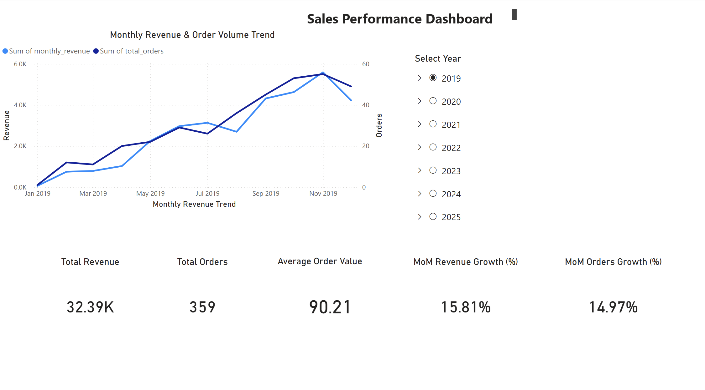

# Power BI Sales Performance Dashboard (UAE)

## 📊 Overview
This project is an interactive **Sales Performance Dashboard built in Power BI** to analyze revenue trends, order volume, KPIs, and month-over-month growth.  
The dashboard is designed to support **business decision-making** by highlighting performance across time, products, and regions.

## 🎯 Business Questions Answered
- How is total revenue trending month-over-month?
- Which products and categories drive the most revenue?
- How does current performance compare to previous months?
- Which regions contribute the highest sales?

## 🧰 Tools Used
- Power BI
- DAX
- Excel (data preparation)

## 📐 Data Model
- Fact table: Sales
- Dimension tables: Date, Product, Region
- Star schema for optimized performance

## 📈 Key KPIs
- Total Revenue
- Total Orders
- Average Order Value
- Month-over-Month Growth %
- Top Performing Products

📊 Dashboard Preview
- 

📥 Power BI File
- project_2_powerbi.pbix (downloadable Power BI file)

## 🧮 Sample DAX Measures (Core KPIs)
Below are examples of key DAX measures used to calculate revenue and month-over-month growth.
- Total Revenue – core business KPI
- Total Revenue = SUM(Sales[Revenue])

