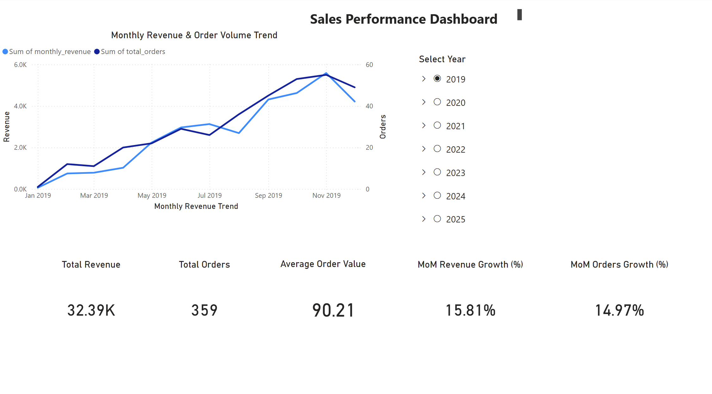

# Power BI Sales Performance Dashboard (UAE)

## Project Overview
This project presents an interactive Power BI dashboard designed to analyze sales performance across revenue, order volume, average order value (AOV), and month-over-month (MoM) growth.

The dashboard supports data-driven decision-making by providing a clear, high-level performance overview alongside trend-based insights for business stakeholders.

---

## Business Objective
To enable business leaders and analysts to:
- Monitor overall sales performance
- Identify growth trends and performance changes over time
- Understand product and regional contributions to revenue
- Support strategic and operational decision-making

---

## Dashboard Preview


---

## Key KPIs
- Total Revenue  
- Total Orders  
- Average Order Value (AOV)  
- Month-over-Month Revenue Growth (%)  
- Month-over-Month Orders Growth (%)  

These KPIs provide visibility into sales scale, customer value, and growth momentum.

---

## Business Questions Answered
- How is total revenue trending month-over-month?
- How does order volume compare with revenue growth?
- Which products and categories generate the highest revenue?
- How does current performance compare to previous months?
- Which regions contribute most to overall sales?

---

## Key Insights (Example)
- Revenue shows a clear month-over-month upward trend, indicating consistent business growth.
- Growth is driven primarily by increasing order volume, suggesting successful customer acquisition.
- A small group of products contributes a significant share of total revenue, highlighting opportunities for focused inventory and marketing strategies.
- Certain regions consistently outperform others, indicating potential areas for targeted expansion.
- MoM growth metrics help identify performance dips and recovery periods, supporting proactive decision-making.

---

## Data Model
The dashboard is built using a star schema to ensure performance and scalability.

- **Fact Table:** Sales  
- **Dimension Tables:** Date, Product, Region  

This structure supports efficient filtering, time intelligence calculations, and future data expansion.

---

## 📐 Sample DAX Measures

```DAX
Total Revenue =
SUM ( Sales[Revenue] )

MoM Revenue Growth % =
DIVIDE (
    [Total Revenue]
        - CALCULATE ( [Total Revenue], PREVIOUSMONTH ( Date[Date] ) ),
    CALCULATE ( [Total Revenue], PREVIOUSMONTH ( Date[Date] ) )
)
```
## Tools & Technologies
- Power BI (Data modeling, DAX, data visualization)
- Microsoft Excel (Data cleaning and preparation)
- GitHub (Version control and documentation)

---

## Interactivity Features
- Year-based filtering for performance comparison
- Dynamic visuals for trend analysis
- KPI cards designed for executive-level summaries
- Visuals supporting analyst-level investigation

---

## UAE Business Context
The dashboard design and KPIs are aligned with UAE-based retail and commercial organizations, where leadership commonly prioritizes monthly growth tracking, executive summaries, and performance benchmarking.

---

## Future Improvements
- Customer segmentation (new vs repeat customers)
- Profitability and margin analysis
- Drill-through pages for deeper product and regional insights
- Role-based views for executives vs analysts

---

## Author
**Anam Althaf**  
Aspiring Junior Data Analyst
